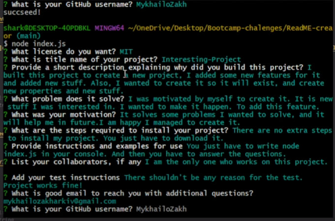
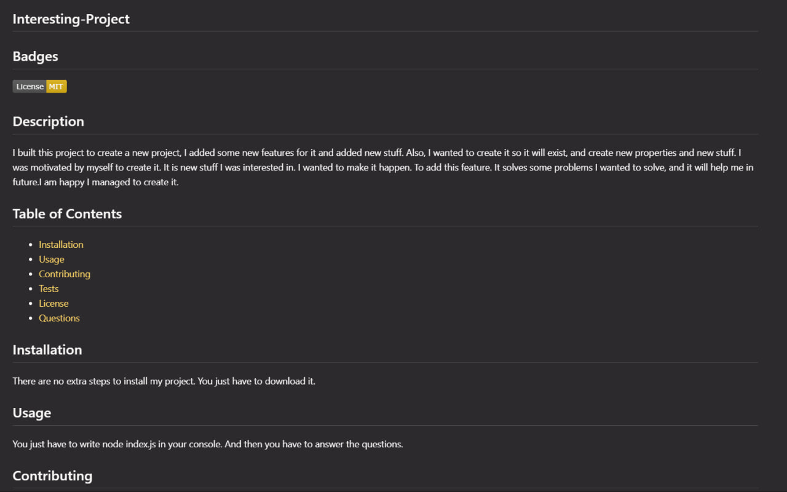
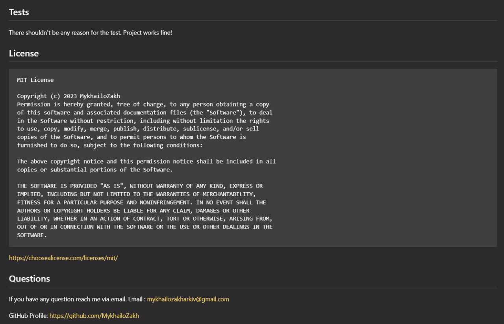

  ## ReadME-creator

  ## Description

  I wanted to creat README creator to spend less time after projects to create it manually. I wanted to add different questions to check what kind of information I wanted to provide inside the ReadME. Also wanted to prin license badge and information if I used one.
  
  ## Table of Contents 
  
  - [Screenshots](#screenshots)
  - [Links](#links)
  - [Questions](#questions)

## Screenshots

In this section I provided screenshots of the Deployed Website Application.

## Links

In this section I added links to the deployed video of the application and to the GitHub repositories with the original codebase.
Vide with usage: 
  https://www.youtube.com/watch?v=gVIbM9Hm0D4&t=69sLinks

Project Repository
    https://github.com/MykhailoZakh/Weather-Checker
  

  ## Questions

  If you have any question reach me via email.
  Email : mykhailozakharkiv0@gmail.com 

  GitHub Profile:
  https://github.com/MykhailoZakh

